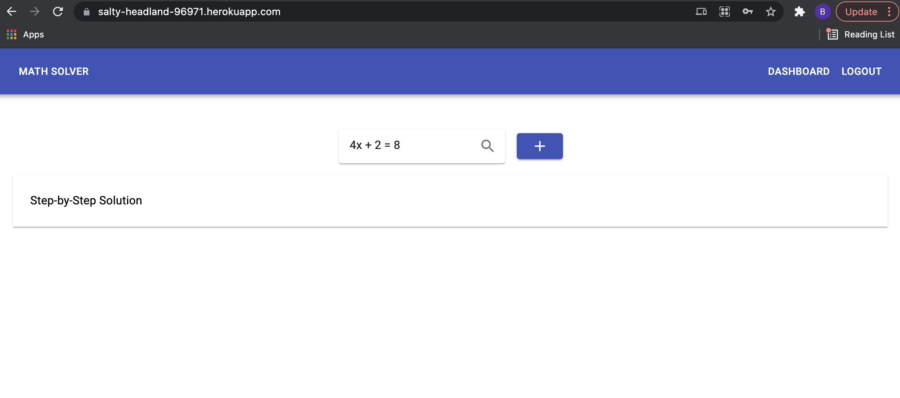

# Math Solver • 

  ## Table of Contents

1. [Description](#description)
2. [Installation](#installation)
3. [Usage](#usage)
4. [License](#license)
5. [Contributing](#contributing)
6. [Tests](#tests)
7. [Questions](#questions)

## [Description](#description)
This app provides step-by-step solutions to common problems in algebra, equations, and calculus faced by individuals struggling in math and allows them to save these solutions as flashcards in their account.
Deployed Application: https://salty-headland-96971.herokuapp.com/

## [Installation](#installation)
To install necessary dependencies, run the following command: npm i, to run npm start

## [Usage](#usage)
Reach out to me 

## [License](#license)
This project is licensed under: 
[MIT](https://choosealicense.com/licenses/mit/)

## [Contributing](#contributing)
Reach out to me y'all

## [Tests](#tests)
N/A

## [Questions](#questions)
If you have questions, you can reach me at bduran04@gmail.com. You can find more of my work at [bduran04@gmail.com](https://github.com/bduran04@gmail.com)

## API/Technologies Used
* Wolfram Alpha API
* Material UI